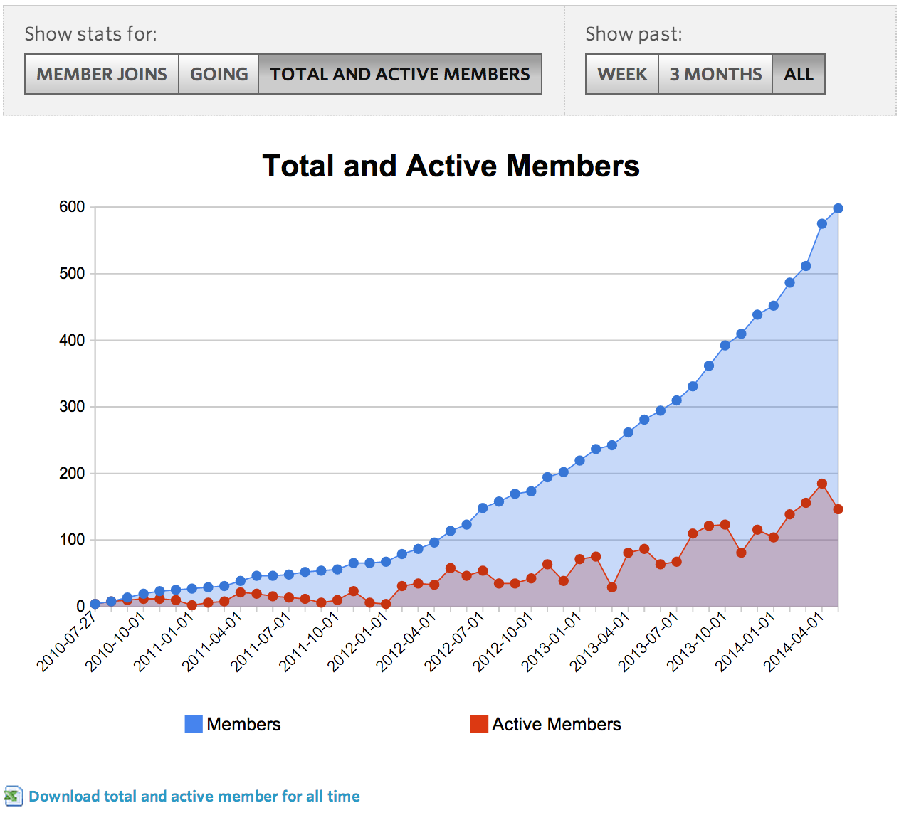

<style type="text/css">
.small-code pre code {
   font-size: 1.1em;
}
</style>

RUGS membership
========================================================
author: Dai ZJ
transition: rotate

Download the data
========================================================

meetup.com -> RUGS - > more - > stats




Read the data from
========================================================


```r
# none of the read from Excel packages worked
# so I converted the Excela file as a csv

file.name <- "R_User_Group_-_Singapore_(RUGS)_Total_and_Active_Members.csv"

rugs1 <- read.csv(file.name)

rugs1 <- rugs1[c("Date","Total.Members","Active.Members")]
```


The data
========================================================


```r
# The data has 3 columns
head(rugs1)
```

```
         Date Total.Members Active.Members
1 2010-07-27              4              4
2 2010-07-28              4              4
3 2010-07-29              5              5
4 2010-07-30              5              5
5 2010-07-31              7              7
6 2010-08-01              8              8
```


Metric: Engagement
========================================================
Define
- Engagement = Active.Members / Total.Members


```r
rugs1$engagement <- with(rugs1,Active.Members / Total.Members)
```


Metric: Engagement - plot
========================================================

 


Metric: Engagement - Summarise by month
========================================================
Firstly Create the month variable

```r
tmp.date <- as.Date(rugs1$Date)
rugs1$yyyy_mm <- format(tmp.date, "%Y-%m")
head(rugs1$yyyy_mm)
```

```
[1] "2010-07" "2010-07" "2010-07" "2010-07" "2010-07" "2010-08"
```


Metric: Engagement - Summarise by month
========================================================

```r
# dplyr from Hadley
# you can use the %.% notation
require(dplyr)
rugs1.summ <- rugs1 %.% 
  group_by(yyyy_mm) %.% 
  summarise(avg_em = mean(engagement),
            avg_am = mean(Active.Members),
            avg_tot = mean(Total.Members))

head(rugs1.summ)
```

```
Source: local data frame [6 x 4]

  yyyy_mm avg_em avg_am avg_tot
1 2010-07 1.0000  5.000    5.00
2 2010-08 0.9663 10.935   11.39
3 2010-09 0.6592 11.733   17.90
4 2010-10 0.4388  9.387   21.29
5 2010-11 0.4632 10.900   23.60
6 2010-12 0.1901  4.774   25.26
```


Metric: Engagement - Summarise by month
========================================================
 


Metric: Engagement - Avg Engagement by Month Last 2 years
========================================================
 


Metric: Engagement - Avg Engagement by Month Last 3 years
========================================================
 


How to improve engagement?
========================================================
* Workshops
  * free workshops
  * pRemium workshops (paid for)
* Your ideas please

Number of BeginneRs
========================================================


```r
# firstly downloaded the list of members
mem.list <- read.csv("member_list.csv")

expri <- 
  mem.list$What.s.your.experience.in.R

expri <- tolower(expri)

require(stringr) # strings operation
keywords <- c("beginner","novice","new")

beginner <- FALSE
for(k in keywords) {
  beginner <- beginner | str_detect(expri,k)
}
length(which(beginner))
```

```
[1] 142
```


The code and presentation can be found at
========================================================


Introduction to R & Data Science
========================================================
- Two day course near Bugis MRT
- 21 - 22 Jun Saturday & Sunday
- Teach basics of R and
- Classic data sciene methods/algorithms
- Focus on application rather theory
- Already have enough students to start the course
- Eventbrite.sg search for R
- Or http://bit.ly/RDPUol
  - RUGS members get $100 off
  - so $188 per seat instead of $288
